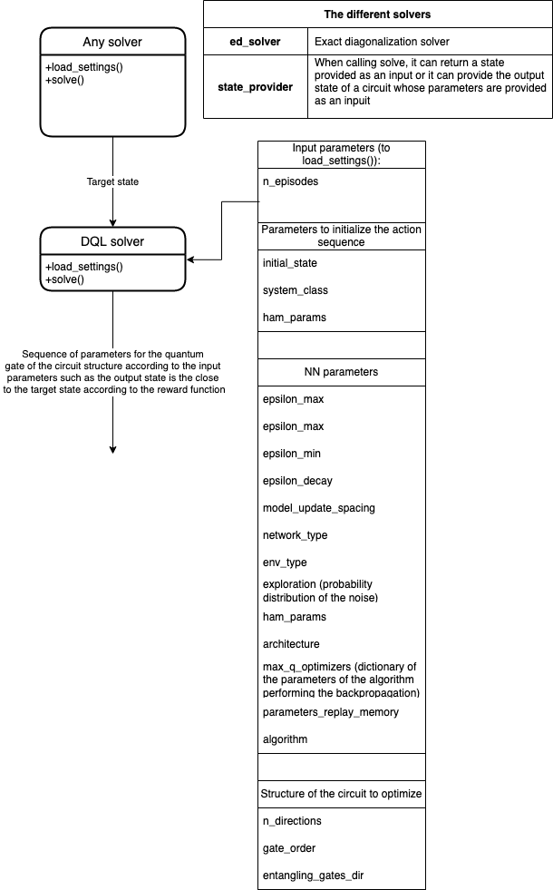

# tdqc: Temporal Difference Quantum Circuit

[](https://www.python.org/)
<!-- # (`tdqc:  Temporal Difference Quantum Circuit`) -->

`tdqc` is a hybrid Python/C++ package designed for quantum state preparation. It consists in optimization of quantum circuit using deep Q-learning. The package contains several solvers **Deep Q-Learning (DQL)**, **Adiabatic State Preparation (ASP)**, **Exact Diagonalisation (ED)**, **state provider** and **Trotterization** which are use to benchmark our method.

[Put the link of the paper once published.]

## Repository Structure

```text
tdqc/
├── tdqc/                        # Core Python and C++ / Cython library
│   ├── interfaces/              # Solver and model class definition 
│   ├── numerics/                # Numerical solvers & simulation engines
│   │   ├── asp/                 # Adiabatic State Preparation parameters
│   │   ├── ed/                  # Exact Diagonalisation algorithms & models
│   │   ├── state_provider/      # Lattice models (Ising, Anderson, Tight-Binding)
│   │   ├── tdqc/                # Core DQL environment, C++/Pybind/Cython backends
│   │   │   ├── system_cpp/      # High-performance C++ Hamiltonians & C++ backend
│   │   │   ├── system_mps/      # Matrix Product States (MPS) system implementation
│   │   │   └── system_py/       # Pure-Python reference implementation
│   │   └── trotterization/      # Trotterized time-evolution routines
│   └── solver/                  # Solvers (DQL, ASP, ED, Trotterization, State Provider)
├── .gitignore                   # Git untracked files filter
├── LICENSE                      # GNU General Public License
├── Makefile                     # Build, test, and doc automation
├── pytest.ini                   # Pytest execution configuration
├── setup.py                     # Package installation & C++/Cython compilation script
└── README.md                    # Project documentation
```
## Installation

1. Environment Setup

Create and activate a virtual environment:

```
python3 -m venv venv
source venv/bin/activate
```

Install core dependencies required for building C++/Cython extensions:

```
pip install numpy setuptools wheel cython pybind11
```
2. Build and Install

Install the package using the included Makefile:

```
make install
```

## DQL Solver Architecture & Workflow

The core workflow of `tdqc` centers on state target generation via auxiliary solvers in particular by optimization through Deep Q-Learning (DQL).



### 1. Target State Generation
Any base solver exposes a standard interface (`load_settings()` and `solve()`) to compute or supply the target quantum state:

| Solver | Description |
| :--- | :--- |
| **`ed_solver`** | Computes target states using Exact Diagonalization. |
| **`state_provider`** | Provides either a pre-defined input state or computes the output state of a quantum circuit parameterized by given input parameters. |

---

### 2. DQL Solver Execution
The target state produced by a base solver is passed into the **DQL Solver**. The DQL solver optimizes quantum gate parameters to construct a circuit sequence that prepares an output state closest to the target state based on a defined reward function.

The DQL solver accepts configuration parameters organized into three main categories:

#### Action Sequence & Environment Setup
* `n_episodes`: Total number of training episodes.
* `initial_state`: Initial quantum state passed to start simulation.
* `system_class`: Underlying physics model class definition.
* `ham_params`: System Hamiltonian parameters.

#### Neural Network & Optimization (`NN parameters`)
* `epsilon_max`, `epsilon_min`, `epsilon_decay`: Exploration schedule controls.
* `model_update_spacing`: Step frequency for updating target networks.
* `network_type` & `architecture`: Neural network topology definitions.
* `env_type`: Environment type wrapper.
* `exploration`: Probability distribution defining action noise.
* `max_q_optimizers`: Dictionary containing optimizer settings and parameters for backpropagation.
* `parameters_replay_memory`: Configuration settings for the experience replay buffer.
* `algorithm`: Underlying DQL variant/algorithm selection.

#### Quantum Circuit Architecture
* `n_directions`: Number of control parameter adjustment directions.
* `gate_order`: Order of quantum gates applied per circuit layer.
* `entangling_gates_dir`: Directional mapping and connectivity for entangling gates.

## Authors and Acknowledgment

* **Author:** Héloïse Albot
* **Supervisor:** Sebastian Paeckel

Special thanks to **Adrien Bolens**; parts of this codebase were adapted from the [adrienbolens/reinforcement-learning-and-quantum-simulations](https://github.com/adrienbolens/reinforcement-learning-and-quantum-simulations) repository.

Part of the code in this repository builds upon and adapts work originally developed by **Adrien Bolens**, available in the repository [reinforcement-learning-and-quantum-simulations](https://github.com/adrienbolens/reinforcement-learning-and-quantum-simulations).

